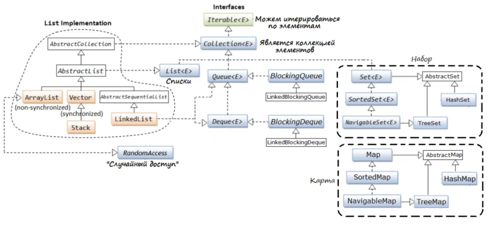

[Java](README.md)

# JCF
  - [Что такое Java Collections Framework?](#что-такое-java-collections-framework)
  - [ArrayList](#arraylist)
  - [LinkedList](#linkedlist)
  - [HashMap](#hashmap)
  - [LinkedHashMap](#linkedhashmap)
  - [TreeMap](#treemap)
  - [Set](#set)
  - [Hashcode и Equals](#hashcode-и-equals)

## Что такое Java Collections Framework?
__Java Collections Framework__ - набор классов и интерфейсов, где реализован функционал по хранению объектов.



[к оглавлению](#JCF)

## ArrayList
+ Реализует интерфейс List.
+ В качества параметра можно указать исключительно ссылочные типы. Примитивы (int, double и т.д.) указать нельзя.

__Методы:__
+ add() - добавляет в конец. Можно добавлять элементы в начало, если укажем следующее add(0, i)
+ get(index) - получаем элемент по индексу
+ size()
+ remove(index) - удаление по индексу. Он не эффективен при больших объемах данных, если удаляем элемент у начала или середины, так как все объекты класса ArrayList используют обычный массив (тут лучше подойдет LinkedList).

```java
// По конвенции JFC правильно делать так
// Так как благодаря ей не нужно думать о реализации
List<Integer> list = new ArrayList<>();
```

__Устройство ArrayList:__
+ По умолчанию создаётся массив размера 10. Этот размер можно задавать в () перед <>.
+ Метод grow() копирует исходные данные в новый массив, который больше текущего.

[к оглавлению](#JCF)

## LinkedList
+ Реализует интерфейс List.
+ Удобно совмещать с ArrayList, так как структура коллекций схожа.

__Сравнение (1) ArrayList и (2) LinkedList:__
+ Добавление в конец 1.000.000 чисел быстрее в 2 раза у (1).
+ Много считываний по индексу из листа в 1000 раз быстрее у (1).
+ Добавление в начало 1.000.000 чисел быстрее у (2).

[к оглавлению](#JCF)

## HashMap
+ Реализует интерфейс Map (отображение).
+ Неупорядоченная коллекция, так как используется хэширование.

__Методы:__
+ put(key, value) - добавление. Дубликатов ключей быть не может
+ get(key) - получаем значение по ключу. Если укажем несущетсвующий ключ, вернется null

__Итерация:__
```java
// entry - (key, value)
// entrySet() - возвращает все entry в map
for (Map.Entry<Integer, Integer> entry : map.entrySet()) {
            System.out.println(entry.getKey() + " " + entry.getValue());
        }
```

[к оглавлению](#JCF)

## LinkedHashMap
+ Сохраняет порядок добавления entry.

[к оглавлению](#JCF)

## TreeMap
+ Сортирует entry по ключу (natural ordering = естественный порядок).

[к оглавлению](#JCF)

## Set
+ Хранит в себе уникальные элементы.
+ HashSet, LinkedHashSet, TreeSet - имеют такие же уникальные свойства, как у Map.

__Методы:__
+ contains(object) - проверяет, есть ли объект в коллекции. Если нам нужно узнавать, то лучше использовать Set

__Можно проводить операции над множествами:__
+ a.intersect(b) - пересечение
+ a.union(b) - объединение
+ a.exclusiveOr(b) - симметрическая разность (остаются лишь уникальные элементы из а и b)
+ a.subtract(b) - разность (a - b, остаются лишь элементы а)

[к оглавлению](#JCF)

## Hashcode и Equals

[к оглавлению](#JCF)
