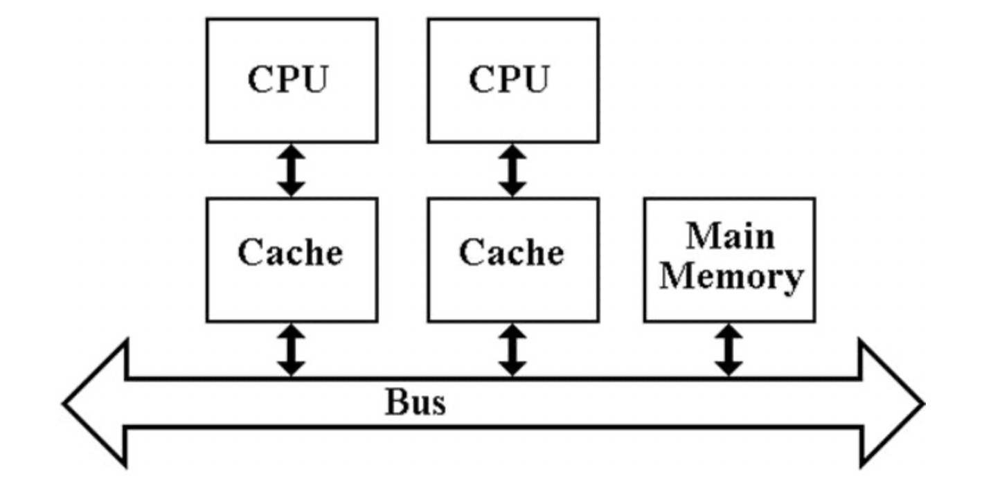

[Java](README.md)

# Многопоточноть
  - [Что такое многопоточность?](#что-такое-многопоточность)
  - [Как открыть новый поток?](#как-открыть-новый-поток)
  - [Ключевое слово volatile](#ключевое-словое-volatile)

## Что такое _многопоточность_?
__Многопоточность__ - механизм, который помогает выполнять код || с другим. 

Если __процессор 1 ядерный__ или Java посчитает, что __распределять потоки на ядра нет смысла__, то в Java многопоточность представлена в виде __виртуальной ||-ти__, то есть задания не выполняются ||, а просто процессор быстро переключается между потоками. Многопоточнось в Java можно сравнить с чтением n кол-ва книг одновременно. __В остальных случаях__, Java старается расспределить задачи между потоками.

__Основная цель__: реализация специального функционала (обработка сложных задач в фоновом режиме, веб-сервис).

[к оглавлению](#Многопоточноть)

## Как открыть новый поток?
__I способ__:
```java
public class App {
    public static void main( String[] args )
    {
        MyThread myThread1 = new MyThread(); // запускаем 1 поток
        myThread1.start();

        MyThread myThread2 = new MyThread(); // запускаем 2 поток
        myThread2.start();
    }
}

class MyThread extends Thread { // Thread - класс, который лежит в пакете java.lang и доступен без import
    public void run() { // переопрделяем run (не определен в Thread) и описываем тот код, который хотиим выполнить
        for (int i = 0; i < 100; i++) {
            System.out.println( "Hello World from new thread!" + i );
        }
    }
}
```

__II способ__:
```java
public class App {
    public static void main( String[] args )
    {
        Thread thread = new Thread(new Runner());
        thread.start();
    }
}

class Runner implements Runnable {
    @Override
    public void run() {
        for (int i = 0; i < 100; i++) {
            System.out.println( "Hello World from new thread!" + i );
        }
    }
}
```
`В данных случаях вывод - спонтанный, так как нет никакой синхронизации и каждый из потоков борется за процессорное время.`

[к оглавлению](#Многопоточноть)

## Ключевое слово volatile
Применяется в том случае, если один из потоков записывает в переменную (main), а другой(ие) читает(ют) из переменной (myThread), чтобы избежать возможной проблемы с Cache Coherency.
```java
public class App
{
    public static void main( String[] args )
    {
        MyThread MyThread = new MyThread();
        MyThread.start();

        Scanner scanner = new Scanner(System.in);
        scanner.nextLine();

        MyThread.offThread();
    }
}

class MyThread extends Thread {
    private volatile boolean running = true; // volatile говорит о том, что 'running' не кэшируется в кэш ядра

    @Override
    public void run() {
        while (running) {
            System.out.println("Hello World");
            try {
                Thread.sleep(500); // закрывает поток на 0.5 секунд
            } catch (InterruptedException e) { // для sleep
                e.printStackTrace();
            }
        }
    }

    public void offThread() {
        running = false;
    }
}
```

Проблема __Cache Coherency__:

У каждого ядра процессора есть свой кэш (быстрая и небольшая память). Там находятся данные, которые нужны ядру здесь и сейчас.

Если вернуться к коду выше, то там была переменная `running`, которая должна была измениться для прекращения потока. Но кэш одного из ядер процессора мог загрузить себе исходное значение `= true` и другой поток не смог бы никак повлиять на него.

В это и заключается проблема "`Когенертности (Свопадения) Кэшей`".




[к оглавлению](#Многопоточноть)
